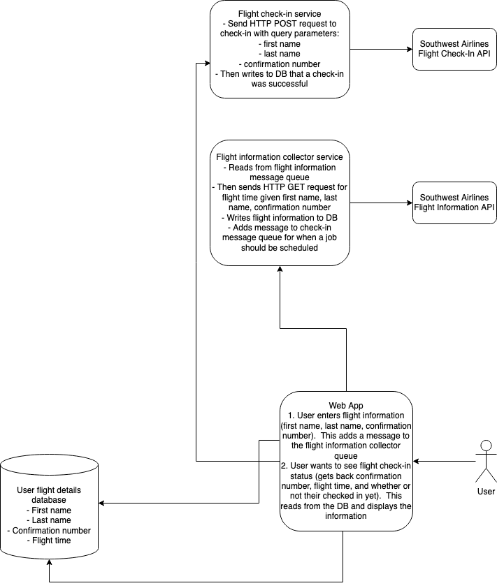
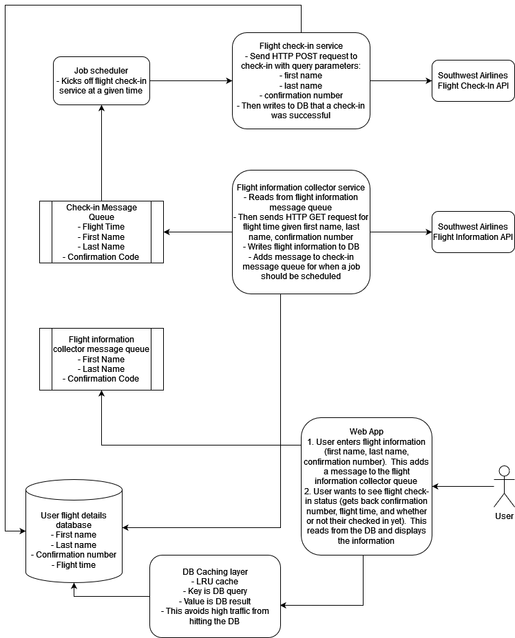

# Airline Automated Check-In


## Description

All airlines require customers to check-in before departure.  Some airlines have open seating policies that are on a first come first serve basis.  Rather than assigning seats, these airlines assign boarding priority positions.

Southwest airlines specifically allows customers to check-in 24 hours prior to boarding to obtain a boarding position.  They also allow one to pay additional fees to get a better boarding position and thus better seat selection.  Since many people forget to check-in exactly at the 24 hour mark or do not wish to pay additional fees, this system that automates the process for Southwest customers to check-in at exactly that 24 hour mark to ensure they have the best boarding position, and thus seat selection and luggage availability as possible.

This system allows users to enter their details (name, confirmation number), and the system will automatically check-in the customer at the first available time and notify them of their boarding position selection.

## Who is this for
The system is geared toward air travel customers--specifically Southwest but potentially more in the future.  It is unique as it solves a frustrating task for many and automates the process.

# Installation/Development
1. Install dependencies

   ```shell
   pip install -r requirements.txt
   ```

1. Start the web application

   ```shell
   FLASK_APP=src/app.py flask run
   ```
1. Open a web browser and go to the URL: http://127.0.0.1:5000/
1. Enter your Southwest confirmation number and last name

## Metrics and Health
1. Metrics are at: http://127.0.0.1:5000/metrics
1. Health check is at: http://127.0.0.1:5000/health

# Continuous Development
1. Unit tests are automatically performed when a PR is submitted.  Checks have been added before merging can take place.
1. Once a PR is merged, unit tests are again automatically performed.

# Continuous Deployment
1. Deployment is automated with GitHub Heroku Integration.
2. See the [deployment configuration](https://github.com/paulboschert/automated-airline-checkin/blob/master/.github/workflows/main.yml)

## Hosting
 * ~~Heroku has been the hosting provider: https://automated-airline-checkin-f2930bf3523f.herokuapp.com/)~~~ -- This is currently disabled.
 * See the [Procfile](https://github.com/paulboschert/automated-airline-checkin/blob/master/Procfile).  

# Current-state architecture


# Complete/Future architecture



